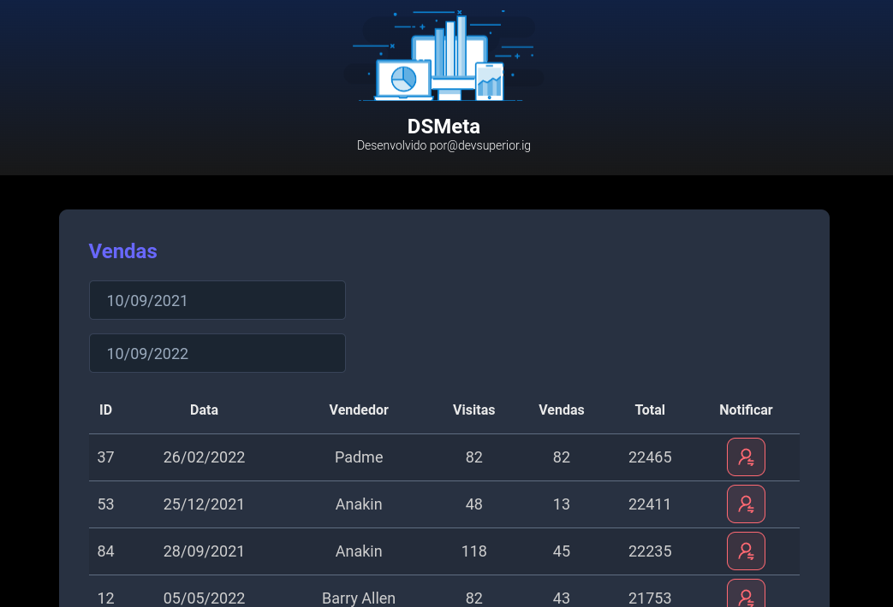

# DSMeta
Site em React e Spring Boot com integração à SMS. Utiliza deploy na nuvem (Netlify - front e Heroku - back)

#### [Link para o site](https://dsmeta-victorl.netlify.app/) (após aberto aguarde um pouco pois o backend demora para iniciar)

### 

### Dependências

- Java 17
- NodeJS 16.x
- yarn
- maven

### Rode localmente
Na pasta frontend execute ```yarn && yarn dev``` e na pasta backend ```./mvnw spring-boot:run```

> Projeto realizado na Semana Spring React da [devsuperior](https://github.com/devsuperior/sds-dsmeta)
